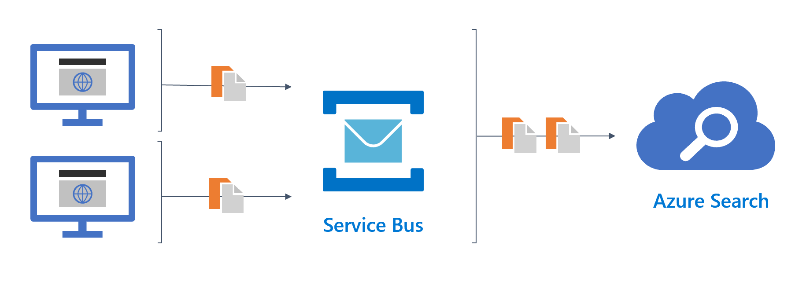

# Optimize indexing using a Service Bus


If your index a high volumne of data, you may see performance improvements by  using a [Service Bus queue](https://docs.microsoft.com/en-us/azure/service-bus-messaging/service-bus-quickstart-portal) to aggregate indexing operations into batch requests before sending them to your search service.



This approach enables the search service to handle higher query volumes by reducing the number of indexing operations hitting the search service. Batch indexing is more efficient than indexing documents one at a time.

## Overview

This repo contains two .NET core console applications: **GenerateData** and **BulkIndexData**. Both applications do exactly what their names indicate.

### GenerateData

This console application generates sample data and sends it to a service bus at a given rate (i.e. 100 documents/second).

The data generated is fictional contacts in the following format:

```json
{
    "Id": "",
    "FirstName": "",
    "LastName": "",
    "EmailAddress": "",
    "PhoneNumber": "",
    "ZipCode": ""
}
```

### BulkIndexData

This console application indexes data from a Service Bus into an Azure Cognitive Search index in batches.

It's configured to let you choose how frequently you want to index data. This could be every second, every five seconds, and so on.

## Prerequisites

To run this sample, you'll need to have the following:

- [Visual Studio 2019](https://visualstudio.microsoft.com/downloads/)
- An [Azure Cognitive Search service](https://docs.microsoft.com/azure/search/search-create-service-portal)
- A [Service Bus queue](https://docs.microsoft.com/en-us/azure/service-bus-messaging/service-bus-quickstart-portal)

## Running the solution

1. Clone or download the repository.
1. Open the BulkIndexData.sln project and the GenerateData.slm project in Visual Studio.
1. Update `appsettings.json` in both projects.
1. Build and run both projects at the same time.

## Contents

| File/folder | Description |
|-------------|-------------|
| `BulkIndexData`| Console app used to index data from a Service Bus Queue in batches |
| `GenerateData` | Console app used to generate contacts and load them into a Service Bus queue |
| `README.md` | This README file. |
| `LICENSE.md`   | The license for the sample. |